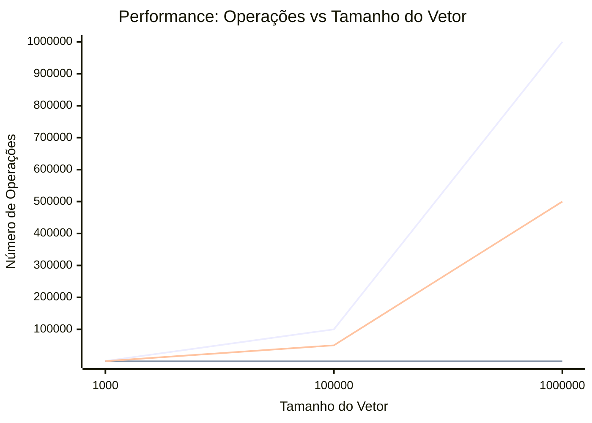

# Experimento de Algoritmos de Busca 🚀

Este repositório contém os exercícios práticos sobre algoritmos de busca sequencial aplicados a vetores de Strings.

##  Relatório de Performance (Exercício 3)

Abaixo estão os dados coletados durante os testes de performance, comparando a **Busca Simples** (que percorre o vetor todo) com a **Busca Interrompida** (que para ao encontrar o alvo).

| Cenário | Tamanho do Vetor | Operações (Simples) | Operações (Interrompida) |
| :--- | :--- | :--- | :--- |
| **Melhor Caso** (Início) | 1.000.000 | 1.000.000 | 1 |
| **Caso Médio** (Meio) | 1.000.000 | 1.000.000 | 500.000 |
| **Pior Caso** (Inexistente) | 1.000.000 | 1.000.000 | 1.000.000 |

### 📈 Gráfico de Complexidade (O(n))

### Análise do Gráfico
No melhor caso (alvo na posição 0), a busca interrompida possui complexidade **O(1)**, enquanto no pior caso (alvo inexistente), ambas as buscas degradam para **O(n)**, percorrendo todos os elementos.

---
